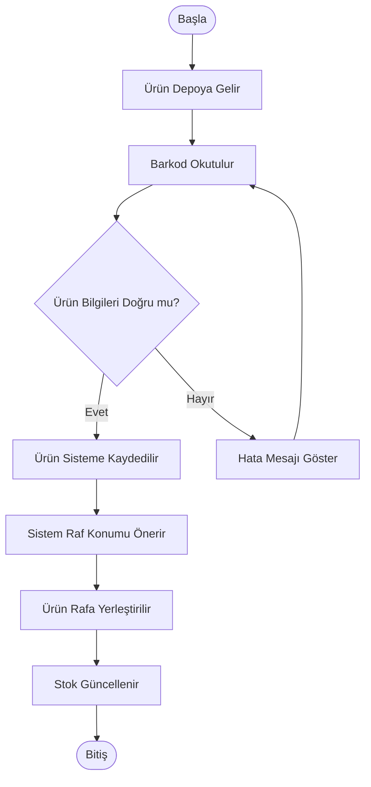

# Activity Diagram

## Amaç

Bu diyagram, Warehouse Management System (WMS) içerisinde ürün kabul sürecinin başlangıcından ürünün rafa yerleştirilmesine kadar olan iş akışını göstermektedir.

## Diyagram

