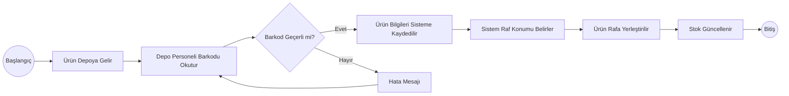

# BPMN Diyagramı

## Amaç

Bu diyagram, Warehouse Management System (WMS) kapsamında ürün kabul sürecinin iş akışını göstermektedir.

## Diyagram

```mermaid
flowchart LR

    A((Başlangıç))
    B[Ürün Depoya Gelir]
    C[Depo Personeli Barkodu Okutur]
    D{Barkod Geçerli mi?}
    E[Ürün Bilgileri Sisteme Kaydedilir]
    F[Sistem Raf Konumu Belirler]
    G[Ürün Rafa Yerleştirilir]
    H[Stok Güncellenir]
    I((Bitiş))

    X[Hata Mesajı]

    A --> B
    B --> C
    C --> D

    D -- Evet --> E
    D -- Hayır --> X
    X --> C

    E --> F
    F --> G
    G --> H
    H --> I
```
