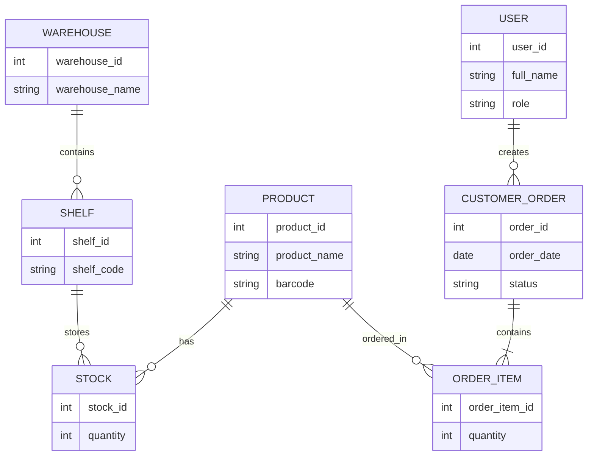

# ER Diagram

## Amaç

Bu diyagram, Warehouse Management System (WMS) içerisinde yer alan temel veri yapıları ve bu yapılar arasındaki ilişkileri göstermektedir.

## Diyagram

```mermaid
erDiagram

    WAREHOUSE ||--o{ SHELF : contains
    SHELF ||--o{ STOCK : stores
    PRODUCT ||--o{ STOCK : has
    CUSTOMER_ORDER ||--|{ ORDER_ITEM : contains
    PRODUCT ||--o{ ORDER_ITEM : ordered_in
    USER ||--o{ CUSTOMER_ORDER : creates

    WAREHOUSE {
        int warehouse_id
        string warehouse_name
    }

    SHELF {
        int shelf_id
        string shelf_code
    }

    PRODUCT {
        int product_id
        string product_name
        string barcode
    }

    STOCK {
        int stock_id
        int quantity
    }

    CUSTOMER_ORDER {
        int order_id
        date order_date
        string status
    }

    ORDER_ITEM {
        int order_item_id
        int quantity
    }

    USER {
        int user_id
        string full_name
        string role
    }
```
