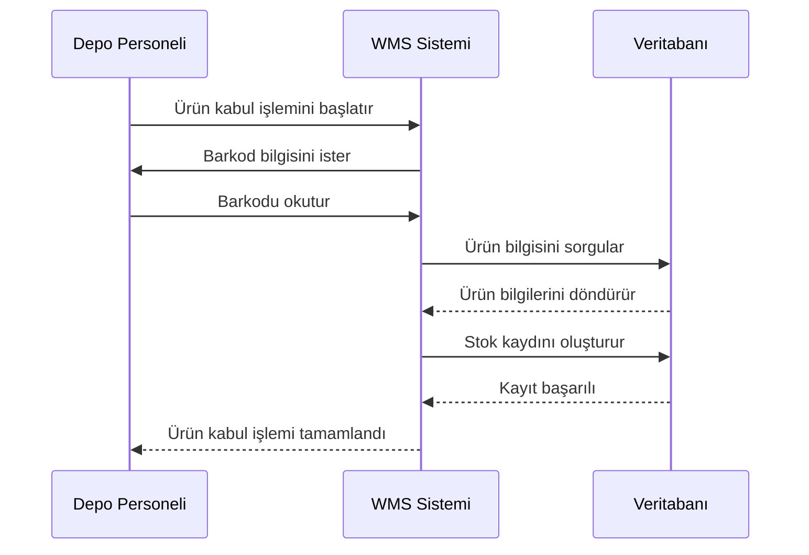

# Sequence Diagram

## Amaç

Bu diyagram, ürün kabul işlemi sırasında kullanıcı, sistem ve veritabanı arasındaki etkileşimi göstermektedir.

## Diyagram

```mermaid
sequenceDiagram

    participant DP as Depo Personeli
    participant WMS as WMS Sistemi
    participant DB as Veritabanı

    DP->>WMS: Ürün kabul işlemini başlatır
    WMS->>DP: Barkod bilgisini ister
    DP->>WMS: Barkodu okutur
    WMS->>DB: Ürün bilgisini sorgular
    DB-->>WMS: Ürün bilgilerini döndürür
    WMS->>DB: Stok kaydını oluşturur
    DB-->>WMS: Kayıt başarılı
    WMS-->>DP: Ürün kabul işlemi tamamlandı
```
