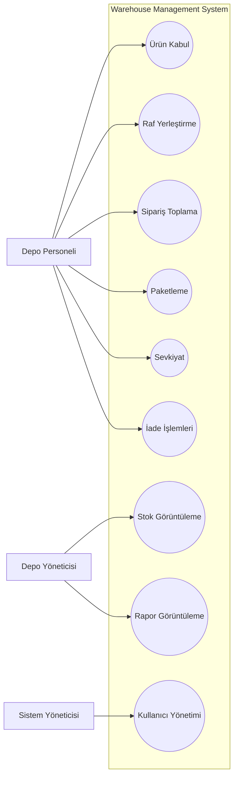

# Use Case Diagram

## Amaç

Bu diyagram, Warehouse Management System (WMS) içerisinde yer alan kullanıcıları (aktörleri) ve bu kullanıcıların sistem üzerinde gerçekleştirebildiği temel işlemleri göstermektedir.

## Aktörler

- Depo Personeli
- Depo Yöneticisi
- Sistem Yöneticisi

## Kullanım Senaryoları

| Aktör | Gerçekleştirebildiği İşlemler |
|--------|-------------------------------|
| Depo Personeli | Ürün kabul etme, ürün yerleştirme, sipariş toplama, paketleme, sevkiyat işlemleri, iade işlemleri |
| Depo Yöneticisi | Stok görüntüleme, rapor görüntüleme, depo operasyonlarını takip etme |
| Sistem Yöneticisi | Kullanıcı yönetimi ve yetkilendirme işlemleri |

## Diyagram

